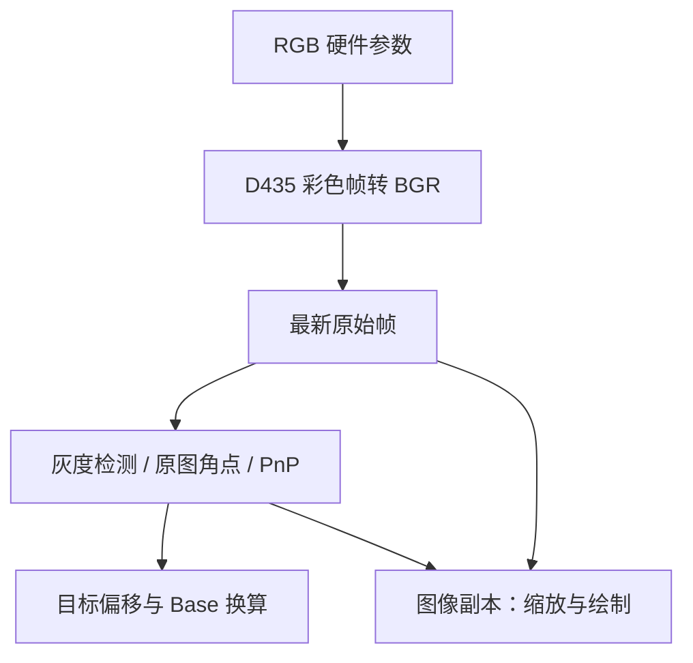

# 同事接入文档

适用：Python 3.8 + PyQt6；同一台 D435、两轴云台、同一套机器人外参。SDK 支持 Python 3.14，二者使用同一个 wheel，第三方二进制依赖版本不同。

## 1. 先选择接入方式

| 需求 | 入口 | 谁持有设备 |
|---|---|---|
| 原有全部功能连同界面一起接入 | `examples/embed_full_panel.py` | 嵌入的完整 AprilTag 界面 |
| 自己设计界面，SDK 采集与识别 | `AprilTagSystem` + `QtSystemBridge` | SDK |
| 已有相机线程，只增加识别定位 | `Locator.process()` | 同事上位机 |
| 只做离线图片测试 | `examples/external_image.py` | 不需要设备 |

同一台相机/同一个串口只由一个模块持有。选定接入方式后，不要再同时启动完整上位机或另一个 RealSense Pipeline 抢设备。

## 2. 整页嵌入：最快得到全部功能

```python
from PyQt6.QtCore import Qt
from apriltag_sdk.qt.app import MainWindow as AprilTagWindow

# 主程序已经创建 QApplication，此处不再创建。
self.vision = AprilTagWindow(settings_path="vision_settings.ini")
self.vision.setWindowFlags(Qt.WindowType.Widget)
self.tabs.addTab(self.vision, "视觉与云台")
self.vision.results_updated.connect(self.on_vision_result)
```

`results_updated` 发出 `dict` 或 `None`，在 GUI 线程中接收：

```python
def on_vision_result(self, payload):
    if payload is None:
        return
    for target in payload["targets"]:
        tag_id = target["tag_id"]
        xyz = target["target_base_mm"]  # 3个mm数值，或None
        if xyz is not None:
            print(tag_id, xyz)
```

也可在 GUI 线程轮询 `self.vision.result_snapshot(max_age_s=0.5)`。事件与查询返回的是显示结果，完整界面沿用旧版规则：用**当前 Cmd 控件数值**换算最新识别位置；修改 Cmd/标定时可能重新换算同一图像。`captured_at`、`frame_seq` 可以判断图像是否更新；查询过期返回 `None`。信号只在数据/显示/停机事件时发出，并不是时效心跳；使用信号保存目标的宿主还须自行按 `captured_at` 定时淘汰过期值。

主窗口关闭时调用 `self.vision.close()`。如果返回 `False`，工作线程还在退出，暂缓关闭宿主并稍后重试。完整处理代码在 `examples/embed_full_panel.py`，不要直接销毁仍持有工作线程的控件。

本方式需要 `[qt,camera]` 依赖，不要调用 `apriltag_sdk.qt.app.main()` 来嵌入；`main()` 是独立程序入口，会创建自己的 QApplication。

## 3. 自定义 PyQt6 界面，SDK 管理相机

```python
from apriltag_sdk import AprilTagSystem
from apriltag_sdk.qt.bridge import QtSystemBridge

self.vision = AprilTagSystem(config_path="sdk_settings.json")
self.vision.locator.configure(tag_size_mm=50, median_enabled=True)
self.vision.locator.load_calibration("camera", "你的相机到云台.json")
self.vision.locator.load_calibration("arm", "你的云台到机械臂.json")
self.vision.locator.set_offsets({0: [0, 0, 0], 3: [20, 0, 10]})

self.bridge = QtSystemBridge(self.vision, self)
self.bridge.result_ready.connect(self.on_batch)
self.bridge.frame_ready.connect(self.on_frame)
self.bridge.error.connect(self.show_error)

# 放在“启动”按钮处理里；默认发现相机的最高可用彩色分辨率。
self.vision.start_camera()
self.bridge.start()
```

如果需要指定配置：

```python
# 须先确认该相机确实支持此分辨率/格式。
self.vision.start_camera(width=1280, height=720, fps=30, pixel_format="bgr8")
# 多台设备时，可额外指定 serial="实际序列号"。
```

`start_camera()` 提交启动请求。启动失败通过状态和 error 传出；调用成功返回并不代表已经收到首帧。

```python
def on_batch(self, batch):
    if batch is None:
        self.clear_targets()  # 无结果、停机或超过默认1秒时效
        return
    # 本帧没有Tag时 targets 是空元组，不沿用上一帧的目标。
    for target in batch.targets:
        print(target.tag_id, target.target_camera_mm, target.target_base_mm)

from PyQt6.QtGui import QPixmap
from apriltag_sdk.qt.image import bgr_to_qimage

def on_frame(self, frame):
    if frame is None:
        self.image_label.clear()
        return
    seq, captured_at, bgr, matrix, distortion, metadata = frame
    self.image_label.setPixmap(QPixmap.fromImage(bgr_to_qimage(bgr)))
```

桥接器用 QTimer 读取最新状态，不为每个相机帧堆积 Qt 事件。预览帧与识别批次有各自 `frame_seq`，不保证同一次轮询读到同一帧；需要精确叠加时只在序号相同时使用该批次 overlays，或保留识别对应图像。

退出时：

```python
self.bridge.stop()
self.vision.close()
```

`close()` 需要等待工作线程释放资源，通常很快，最多按相机关闭超时等待。若抛出 `TimeoutError`，保留对象，延后再次关闭。大型宿主可把停止请求与等待安排在自己的生命周期任务中，完成后再销毁界面。不要在 SDK 后台回调内调用 `close()`。

## 4. 同事已有相机：外部图像模式

```python
from apriltag_sdk import Locator

locator = Locator(tag_size_mm=50, median_enabled=True)
locator.load_calibration("camera", camera_json_path)
locator.load_calibration("arm", arm_json_path)
locator.set_offsets({3: [20, 0, 10]})

# 在同事自己的识别工作线程执行：
batch = locator.process(
    image_bgr=frame_bgr,
    camera_matrix=K,
    dist_coeffs=D,
    pan_cmd_deg=pan_cmd,
    tilt_cmd_deg=tilt_cmd,
    captured_at=received_monotonic_time,
    frame_seq=frame_number,
)
```

输入要求：

- `frame_bgr` 为 `numpy.uint8`、`H×W×3` 的 BGR 原始图像，处理期间不能被其他线程改写。
- K 为当前图像分辨率对应的 3×3 内参，D 为 OpenCV 针孔畸变系数（4/5/8/12/14 个）。图像若经过裁切、旋转、缩放或去畸变，必须同步调整 K/D。不要把 RealSense fisheye/inverse Brown 等模型未经转换直接当成 OpenCV 针孔系数。
- `captured_at` 使用 `time.monotonic()` 时基。不能传毫秒、Unix 时间或 RealSense 设备时间戳冒充主机单调时间。
- Pan/Tilt 是这套标定使用的 **Cmd 角度**。若同事持有云台串口，直接把他的 Cmd 传入，不要再次由 SDK 打开串口；不要传编码器读数。
- 不要把已画框、已添加文字、经过 GUI 色彩转换的预览图片送回检测。

`Locator.process()` 是同步函数，请放在工作线程。它对同一实例的调用加锁；不同图像流分别创建 Locator，避免把不同相机/目标历史混到一起。

如果已有生产者/消费者结构，可使用 `apriltag_sdk.frames.LatestFrameBuffer`：生产者每次发布一张自己持有的图像并不再修改；消费者只处理序号变化后的最新一帧。`snapshot()` 返回借用数组，不能原地绘图；使用 `annotate()` 或 `.copy()`。

无设备可运行 `examples/external_image.py --synthetic` 检查完整输入/输出样式。

## 5. 云台接入

```python
from apriltag_sdk import GimbalController

gimbal = GimbalController()
ports = gimbal.list_ports()
gimbal.connect("COM5", 115200)
gimbal.set_tx_rate_hz(12)

# 以下仅在用户明确点击运动按钮时调用：
gimbal.command(90, 90)
# 按钮 pressed：立即一步，按住260ms后连续改变目标
gimbal.start_jog(pan_direction=1, tilt_direction=0, step=1, speed=20)
# 按钮 released，以及失焦/页面切换：
gimbal.stop_jog()

gimbal.set_home(90, 90)  # 只设置Home，不运动，也不改变标定零位
gimbal.home()           # 此调用发出Home目标
feedback = gimbal.feedback_snapshot()
transmit = gimbal.tx_snapshot()
cmd = gimbal.command_snapshot()
gimbal.disconnect()
```

`AprilTagSystem.gimbal` 就是此控制器。`connect()` 不自动发送位置指令；在本次连接尚未调用 `command()` 时，托管相机拿不到已知 Cmd，Base 返回 `None`。发送过 Cmd 后，它采集的每帧附带主机接收图像时看到的 Cmd 快照。云台实际到位仍需由宿主按设备行为判断。

短按/长按改变的是期望目标；TX 线程按上限频率只发最新目标，可能覆盖中间值。反馈源仍是 GBK 文本，“舵机A角度”为 Pan，“舵机B角度”为 Tilt。断线、stale、TX error 字段用于状态显示。

## 6. 相机调色与识别输入

```python
# 等待第一次 camera_options_snapshot() 非None，再请求。
snapshot = system.camera_options_snapshot()
generation = system.request_camera_options({
    "enable_auto_exposure": 0,
    "exposure": 100,
})
```

数值必须落在该相机返回的实际范围内，示例 100 不是通用推荐值。只有快照里的 supported 参数可用。自动曝光开启时禁止手动曝光/增益；自动白平衡开启时禁止手动白平衡。SDK 会先写自动开关，再写关联的手动值。

请求是异步的。返回 generation 只表示已入待处理槽，`snapshot["applied"]` 才表示该批已成功写入并读回；失败看 `errors`。SDK 只记住成功值，`save_config()` 或正常 `close()` 写入配置，按相机序列号恢复。

输入关系：



硬件调参影响两条分支；预览加工不会改变原始帧。识别内部缩图只用于搜 Tag，定位角点回到原图后再求解。

## 7. 复用界面控件

```python
from PyQt6.QtCore import QSettings
from apriltag_sdk.qt.calibration_editor import CalibrationPanel
from apriltag_sdk.qt.camera_options import RGBOptionsPanel
from apriltag_sdk.qt.views import FrameView3D

settings = QSettings("vision_widgets.ini", QSettings.Format.IniFormat)
cal_panel = CalibrationPanel(settings)
cal_panel.bind_locator(system.locator)
cal_panel.restore()
view = FrameView3D()

def update_frames(chain):
    cmd = system.gimbal.command_snapshot()
    if cmd["pan_cmd_deg"] is None:
        view.set_frames(None, "等待Cmd")
    else:
        view.set_frames(chain.frame_transforms(cmd["pan_cmd_deg"], cmd["tilt_cmd_deg"]))

cal_panel.chain_changed.connect(update_frames)
# 云台Cmd变化时也调用update_frames(system.locator.calibration_chain())。
```

`CalibrationPanel` 保留原值/编辑副本、参数修改、选择文件、导出和持久化。`bind_locator` 是从面板到 Locator 的单向同步，只绑定一次。如果程序直接改变 Locator 的标定，面板不会自动反向更新；整合时选一个配置拥有者。

RGB 控件可绑定：

```python
rgb_panel = RGBOptionsPanel(settings)

def request(values):
    try:
        rgb_panel.minimum_generation = system.request_camera_options(values)
    except RuntimeError as exc:
        rgb_panel.reset()
        print(exc)

def update_rgb(snapshot):
    if snapshot is None:
        rgb_panel.reset()
    else:
        rgb_panel.update_snapshot(snapshot)

rgb_panel.requested.connect(request)
bridge.rgb_options.connect(update_rgb)
```

独立 RGB 面板有自己的 QSettings 恢复逻辑，AprilTagSystem 也有 JSON 恢复逻辑。自定义组合时不要在两处维护相互冲突的同一相机设置：若使用该面板作为拥有者，可不传 `config_path` 给 System，并且不恢复含旧 RGB 值的 JSON；或者直接按 `camera_options_snapshot()` 构建宿主自己的参数控件。完整上位机已统一用 QSettings，无此重复问题。

## 8. 坐标契约与结果有效性

| 数据 | 约定 |
|---|---|
| `Target.*_mm` | 毫米 |
| `CalibrationChain` 4×4 平移和 `transform_point` | 米 |
| Cmd、Home、编辑 RPY | 度 |
| JSON `rotation_rpy` / `rotation_rotvec` | 弧度 |
| Camera | +X 向右，+Y 向下，+Z 向前 |
| Tag | +X Tag右，+Y Tag上，+Z Tag正面向外 |
| `rotation_camera_tag` | 把 Tag 向量转到 Camera 的旋转矩阵 |
| Base | 随所选 Arm 标定文件定义的机械臂基坐标 |

计算为：`目标Camera = Tag中心Camera + R_camera_tag × 偏移Tag`，再经 `T_arm_panbase × R_pan × R_tilt × T_tilt_camera` 变换至 Base。Pan/Tilt 的正负号与零位来自所选相机标定模型。

**不存在文件名或历史来源匹配门槛。** 两份文件可任意选择；类型与数值必须有效。用户确认的参考文件随包提供，SDK 不会自动把它们套到任意新设备上。

Base 为 `None` 时不能当成 `[0,0,0]` 使用。`base_unavailable_reason` 给出原因。上一次有 Tag、本次没有时必须清空目标。读取结果时检查年龄和目标 ID，识别帧率/图像帧率不同。

托管 SDK 的 Cmd 快照采样于**主机收到彩色帧**时，不是曝光与机械运动的硬件同步。移动中存在图像延迟、指令发送延迟和云台未到位误差；当前 Legacy 模型不会用 Encoder 自动补偿。`reprojection_error_px` 是该帧原始 PnP 的重投影误差，不是 Base 定位精度保证。

## 9. 同事接入时的最小验收

1. 在独立环境运行合成示例，确认输出 ID 3，位置/偏移单位正确。
2. D435 实机启动，确认使用当前分辨率的真实内参，调色同时反映在识别输入。
3. 输入真实 Tag 边长、既有两份标定、Cmd；和原上位机在同一静止姿态比较 Camera/Base 输出。
4. 对单个 ID 改偏移，确认其他 ID 不变；切换文件原值/编辑副本，确认源 JSON 未被覆盖。
5. 检查串口反馈、短按/长按、松手停止改变目标、Home，与旧版行为一致。
6. 相机停止/断线/无Tag后清空有效结果，重复开关与退出没有残留设备占用。
